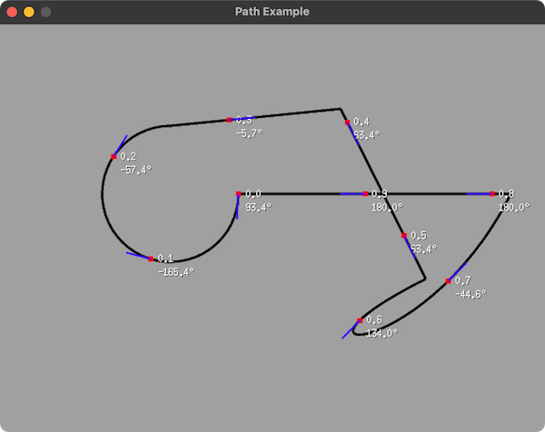

# ebiten_path



Ebitengine port from [ofPolyline](https://openframeworks.cc/documentation/graphics/ofPolyline/) (openFrameworks)

Useful for path animation using `GetPointAtPercent()` / `GetDegreesAtPercent()` / `GetRadiansAtPercent()`

## Example

```bash
$ go run ./example/main.go
```